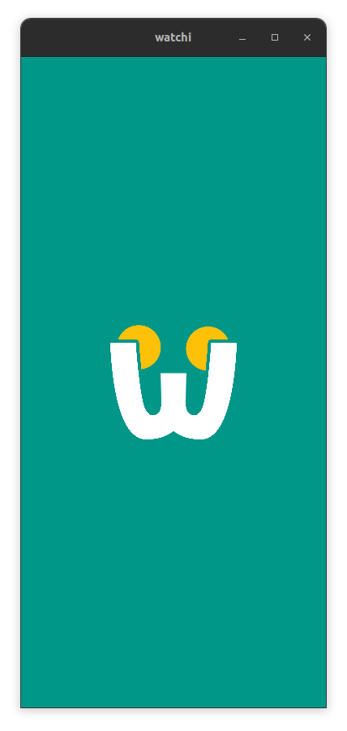
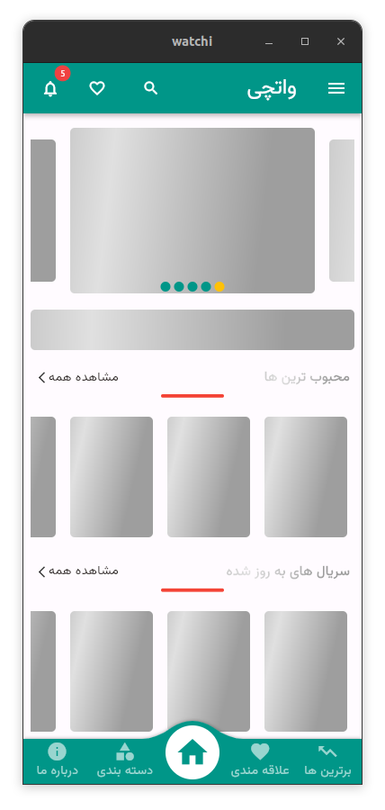
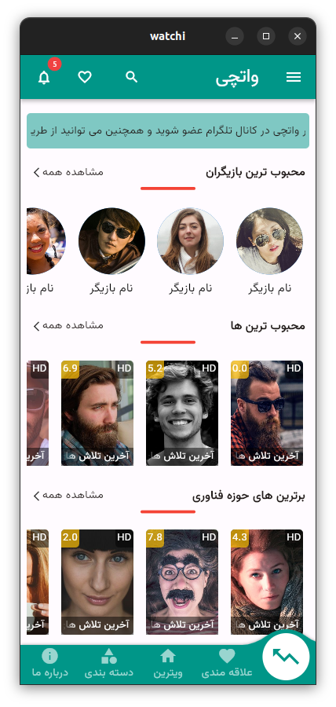
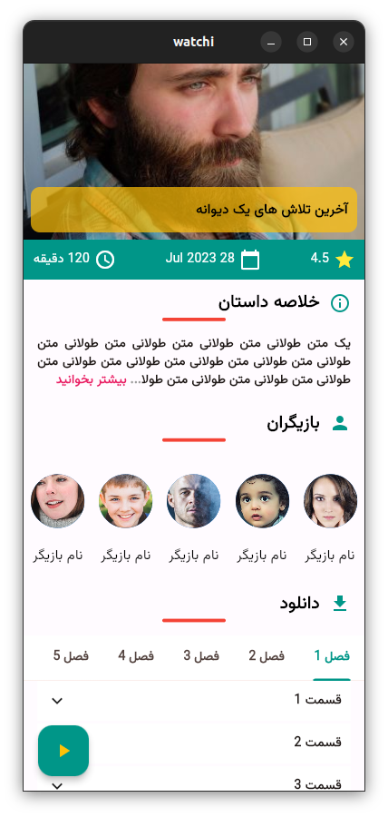
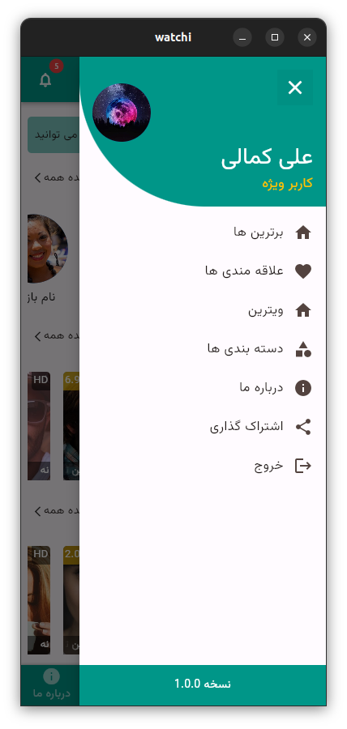
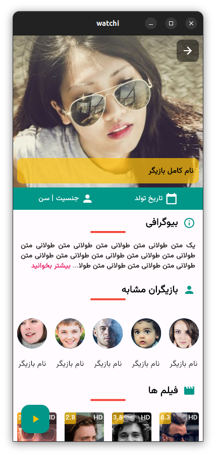

# Watchi 📺
  
_This is a flutter app to watch and download movies and series._

<br>

# Starting 🚀

_These instructions allow you to get a copy of the running project on your local machine._

## Pre-requisites 📋
_You need flutter sdk: '>=3.0.6 <4.0.0'

## Installation 🔧

- Make a git clone or download it in zip and unzip it.
```bash
git clone https://github.com/irania9O/Watchi.git
```
- Get in the directory of the project.
```bash
cd Watchi
```

<br>

# Run 🚀:

```bash
flutter run [your device]
```
<br>

# Build 🚀:

```bash
flutter build [your device] 
```
<br>

## Available devices 📋:
```bash
  aar         Build a repository containing an AAR and a POM file.
  apk         Build an Android APK file from your app.
  appbundle   Build an Android App Bundle file from your app.
  bundle      Build the Flutter assets directory from your app.
  linux       Build a Linux desktop application.
  web         Build a web application bundle.
```

# Ideas 💡:

- Add a login page for vip users or something like that.
- Add a download manager to download files with packages like flutter_downloader.
- Add a online player to play videos with packages like video_player.
- Add a settings page to change the language of the app and other things.
- Fetch data from an api.
- Complete about page.
- Complete the app with more features.

# Thanks 🎁:
- Thanks to [Mahdi Moaref Dezfloi](http://github.com/mahdimd1382) for the logo.
- Thanks to [Flutter](https://flutter.dev/) for the framework.

<br>

# Screenshots
<p float="left">
  
   
</p>
<p float="left">
  
   
</p>
<p float="left">
  
   
</p>